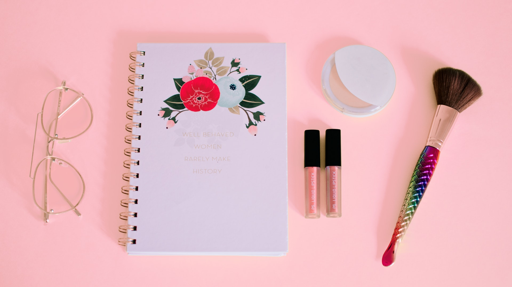

# FlexboxCollage
This is an exercise for flexbox css. We will be creating a photo collage using flexbox and insert it in a CSS shape.

*First step, is to create first your desired CSS shape. For me, I used the diamond because it is easier and less complicated.*

1. Create the outer div of the diamond:

HTML:

````
<div id="main-container"> <!--create a container for UI purposes-->
    <div class="diamond"> <!--OUTER CONTAINER-->
        <div class="dia-1"> <!--iNNER CONTAINER -->
            // insert other divs here.
        </div>
    </div>
</div>
````

CSS: 

````
html, body, #main-container {
    height: 100%;
    min-height: 100%;
    box-sizing: border-box;
}

body {
    padding: 0;
    margin: 0;
    font-family: -apple-system, BlinkMacSystemFont, 'Segoe UI', Roboto, Oxygen, Ubuntu, Cantarell, 'Open Sans', 'Helvetica Neue', sans-serif;
}

#main-container {
    background: #bd574e;
    text-align: center;
    overflow: hidden;
}

.diamond {
    transform: rotate(45deg) translateY(10px);
    border: 3px solid #dedef0;
    margin-top: 150px;
}

.diamond .dia-1 {
    width: 355px;
    height: 355px;
    transform: rotate(-45deg) translateY(-74px);
}
````

2. Create the collage:

*You have to collect your own images with different sizes so that you can see the magic of this photo collage*
> Create the containers: 

HTML:

```` 
 <div id="layout" class="flex">
     <div class="column">
         
         
         
         
      </div>
      // .. more column divs
 </div>
 ````
 
 CSS: 
 
 ````
 .flex {
    display: flex;
    flex-wrap: flex;
    display: -webkit-flex;
    -webkit-flex-wrap: wrap;
    padding: 0 0px;
    transform: rotate(-45deg);
    height: 700px !important;
    width: 700px !important;
}

.image {
    flex: 1 0 100px;
    margin: 0 -1 -1 0;
}

.layout {
    transform: rotate(-45deg);
}

div#layout {
    margin: -119px; /*adjustible depending on the shape used.*/
}

.column {
    flex: 25%;
    padding: 0 4px;
}

.column img {
    margin-top: 8px;
    vertical-align: middle;
    width: 100%;
}
````
